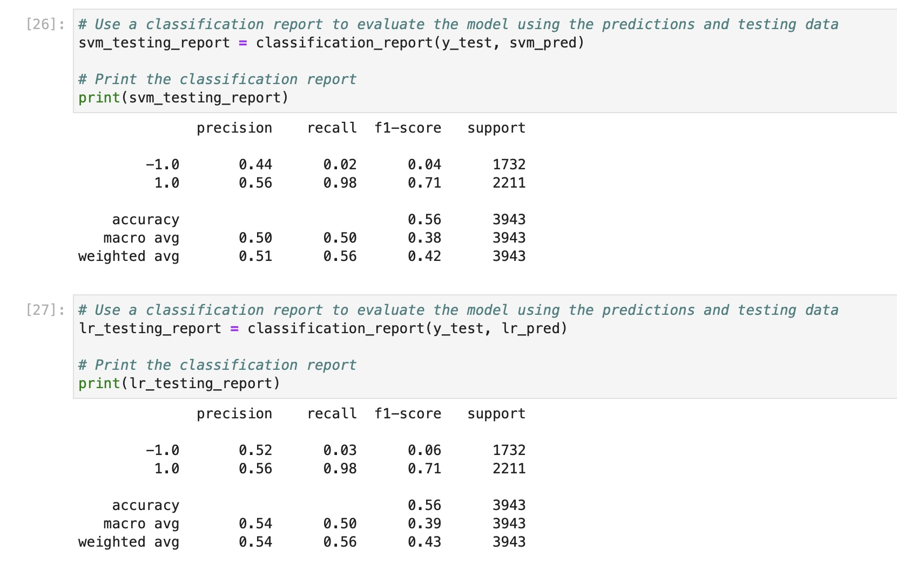
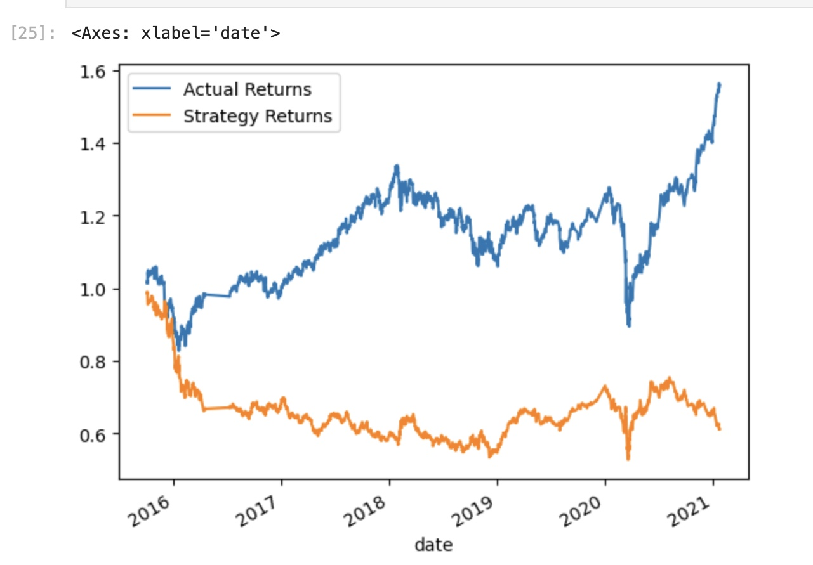
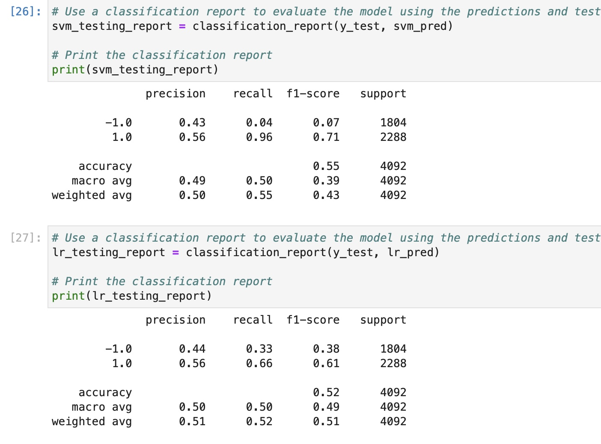
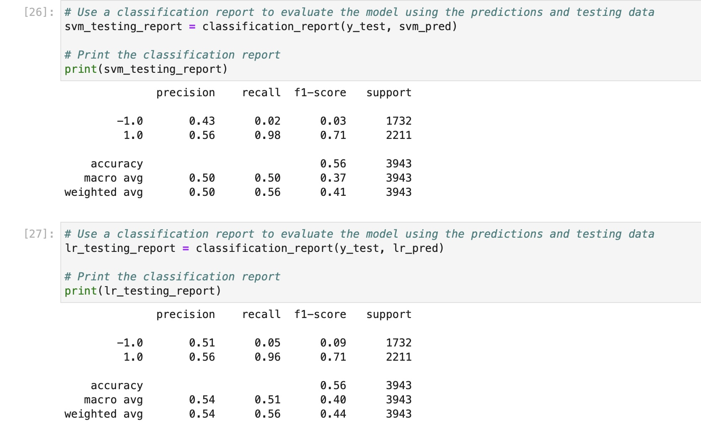

# Machine Learning Trading Bot

## Background

In this Challenge, as the role of a financial advisor at one of the top five financial advisory firms in the world. The firm constantly competes with the other major firms to manage and automatically trade assets in a highly dynamic environment. In recent years, the firm has heavily profited by using computer algorithms that can buy and sell faster than human traders.

The speed of these transactions gave your firm a competitive advantage early on. But, people still need to specifically program these systems, which limits their ability to adapt to new data. You’re thus planning to improve the existing algorithmic trading systems and maintain the firm’s competitive advantage in the market. To do so, you’ll enhance the existing trading signals with machine learning algorithms that can adapt to new data.

## What're Created

* Establish a Baseline Performance

* Tune the Baseline Trading Algorithm

* Evaluate a New Machine Learning Classifier

* Create an Evaluation Report

### Establish a Baseline Performance

In this section, you’ll run the provided starter code to establish a baseline performance for the trading algorithm. To do so, complete the following steps.

Open the Jupyter notebook. Restart the kernel, run the provided cells that correspond with the first three steps, and then proceed to step four.

1. Import the OHLCV dataset into a Pandas DataFrame.

2. Generate trading signals using short- and long-window SMA values.

3. Split the data into training and testing datasets.

4. Use the `SVC` classifier model from SKLearn's support vector machine (SVM) learning method to fit the training data and make predictions based on the testing data. Review the predictions.

5. Review the classification report associated with the `SVC` model predictions.

6. Create a predictions DataFrame that contains columns for “Predicted” values, “Actual Returns”, and “Strategy Returns”.

7. Create a cumulative return plot that shows the actual returns vs. the strategy returns. Save a PNG image of this plot. This will serve as a baseline against which to compare the effects of tuning the trading algorithm.

8. Write your conclusions about the performance of the baseline trading algorithm in the `README.md` file that’s associated with your GitHub repository. Support your findings by using the PNG image that you saved in the previous step.

**Answer:**  
--
On the SVC model created the classification report, which is 55% accuracy rate, recall rate on 1.0,-1.0 class is 96%, 4%, respectively.
In summary, this classification report indicates that the model has a relatively high recall for class 1.0 but a low recall for class -1.0. The F1-score for class 1.0 is also higher, suggesting that the model is better at identifying this class. However, the overall accuracy is moderate, and there is room for improvement, especially in correctly identifying class -1.0. Depending on the specific goals and requirements of your application, you may need to further fine-tune the model or consider different algorithms to improve performance.

### Tune the Baseline Trading Algorithm

In this section, you’ll tune, or adjust, the model’s input features to find the parameters that result in the best trading outcomes. (You’ll choose the best by comparing the cumulative products of the strategy returns.) To do so, complete the following steps:

1. Tune the training algorithm by adjusting the size of the training dataset. To do so, slice your data into different periods. Rerun the notebook with the updated parameters, and record the results in your `README.md` file. Answer the following question: What impact resulted from increasing or decreasing the training window?

    > **Hint** To adjust the size of the training dataset, you can use a different `DateOffset` value&mdash;for example, six months. Be aware that changing the size of the training dataset also affects the size of the testing dataset.

**Answer:** By increasing the training window to 6 month-period, the result: 
--
I. the 6 month-period generate a higher accuracy rate by 1%
II. the logistic regression model performs almost similar to the SVM model since it has the same accuracy score(56%). 
III. However, the logistic regression model does a better job predicting profitable short opportunities, as evidenced by its higher recall score on the `-1.0` class (by 1%). 

2. Tune the trading algorithm by adjusting the SMA input features. Adjust one or both of the windows for the algorithm. Rerun the notebook with the updated parameters, and record the results in your `README.md` file. Answer the following question: What impact resulted from increasing or decreasing either or both of the SMA windows?

**Answer:** By increasing the SMA Short window to 20, the result: 
--
I. generate a higher accuracy rate by 1%
II. the logistic regression model performs worse than the SVM model since it has a lower accuracy score. 
III. However, the dataset seems to be overfitting since the recall of the SVM model is 100% on the 1.0 class. 

3. Choose the set of parameters that best improved the trading algorithm returns. Save a PNG image of the cumulative product of the actual returns vs. the strategy returns, and document your conclusion in your `README.md` file.

### Evaluate a New Machine Learning Classifier

In this section, you’ll use the original parameters that the starter code provided. But, you’ll apply them to the performance of a second machine learning model. To do so, complete the following steps:

1. Import a new classifier, such as `AdaBoost`, `DecisionTreeClassifier`, or `LogisticRegression`. (For the full list of classifiers, refer to the [Supervised learning page](https://scikit-learn.org/stable/supervised_learning.html) in the scikit-learn documentation.)

2. Using the original training data as the baseline model, fit another model with the new classifier.

3. Backtest the new model to evaluate its performance. Save a PNG image of the cumulative product of the actual returns vs. the strategy returns for this updated trading algorithm, and write your conclusions in your `README.md` file. Answer the following questions: Did this new model perform better or worse than the provided baseline model? Did this new model perform better or worse than your tuned trading algorithm?

**Question:** Did the `LogisticRegression` perform better than the `SVM`?

**Answer:** The SVC model performs better than to the logistic regression model since it has the higher accuracy score(55%). Furthermore, the SVC model does a better job predicting profitable long opportunities, as evidenced by its higher recall score on the `1.0` class (by 30%). 

### An Evaluation Report

**Answer:** By increasing SMA sort-window to 20 and increasing the training window to 6 month-period, the training data is more reasonable and informative. Maybe. The logistic regression model performs almost similar to the SVM model since it has the same accuracy score(56%). However, the logistic regression model does a better job predicting profitable short opportunities, as evidenced by its higher recall score on the `-1.0` class (by 3%). Ultimately, which model is best may depend on which class we care most about predicting, as well as which has better overall economic returns compared to a long-only investment.

---

## Submission

* Use the started code provided to create the machine learning trading bot and host the notebook and the required files.

* Include a `README.md` file with your conclusions as requested.

* Submit the link to your GitHub project to Bootcamp Spot.

---

© 2022 edX Boot Camps LLC. Confidential and Proprietary. All Rights Reserved.
